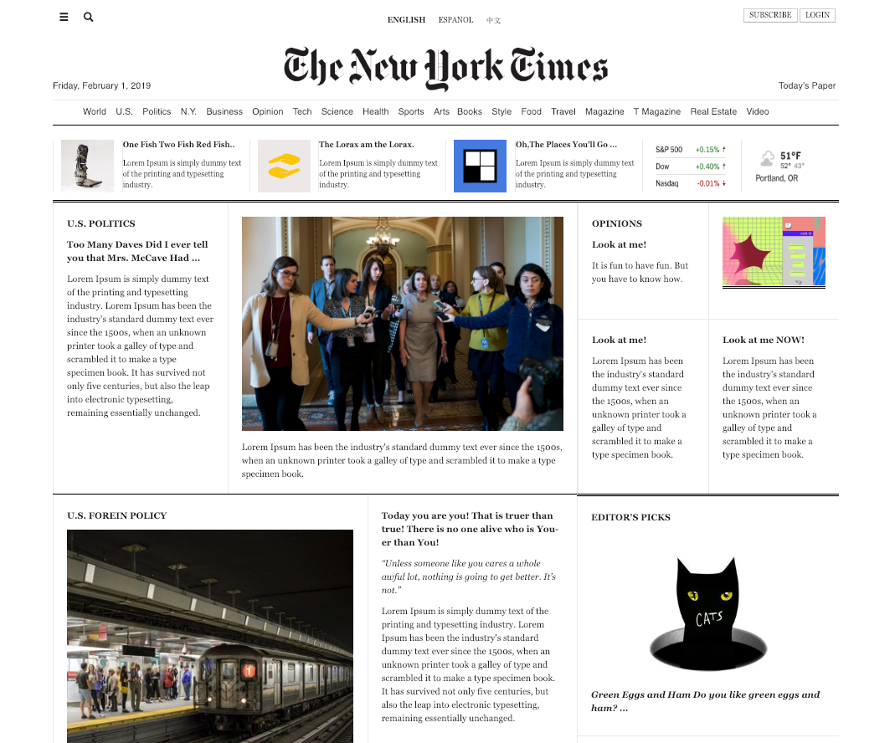

<h3 align="center"> New York Times Clone </h3>
<h4 align="center"> By Ngan Nguyen </h4>

## Description

_This is a clone of the New York Times website for educational purpose._

# 

## Table of content

- [Installation](#installation)
- [API Setup](#API)
- [Technology](#technology)
- [License](#license)

## Installation

1. Go to terminal and clone this repository:
```
$ git clone git repository link
```
2. Change into the project directory and install npm
```
$ npm install
```
3. Build the app:
```
$ npm run build
```
4.  To run the program:
```
$ ng serve
```

## API
* Firebase
* Weather

## Completed Features
* Firebase Google authentication enabled for Login.
* Weather API integration which allows the user to change the location and get the data for the location.
* Shows the current date when on the website.
* Horizontal navigation to direct users to NYT's content.


## Planned Features
* Use Stock API or widget for realtime data related to S&P 500, Dow, Nasdaq.
* Display the time of published article.
* Responsive with mobile devices.
* Expand navigation icons to display additional navigation items.
* Expand search functionality to allow user of search content on website.
* Get live articles via the NYT API and integrate with the clone website.
* Store the articles in Firebase Database to be retrieved at a later time.

## Technology
* Javascript
* Angular
* HTML
* CSS

## License
* This project is licensed under the MIT License - see the LICENSE.md file for details
